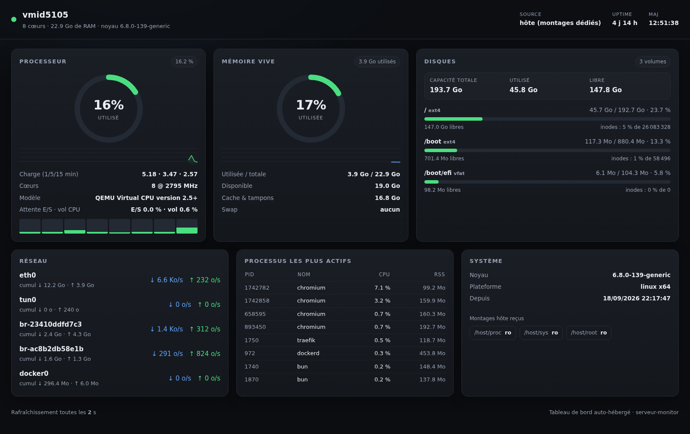

# serveur-monitor

Tableau de bord auto-hébergé pour surveiller **le disque, le CPU et la RAM** d'un
serveur, en temps réel, depuis un navigateur.

Aucune dépendance npm, aucune base de données : un seul processus Node.js qui lit
`/proc` et `/sys` et sert une page web.



## Ce que le tableau de bord affiche

| Carte | Contenu |
|---|---|
| **Processeur** | taux d'utilisation global, charge 1/5/15 min, taux par cœur, modèle, attente E/S, vol CPU (steal), historique 2 min |
| **Mémoire vive** | utilisée / totale, disponible, cache & tampons, swap, historique 2 min |
| **Disques** | un volume par système de fichiers : espace utilisé, libre, pourcentage, inodes |
| **Réseau** | débit entrant / sortant par interface + cumul depuis le démarrage |
| **Processus** | les 8 processus les plus gourmands en CPU (PID, nom, %, RSS) |
| **Système** | noyau, plateforme, date de démarrage, températures si exposées |

Le navigateur interroge `/api/metrics` toutes les 2 secondes ; la collecte côté
serveur tourne en continu, donc les débits et pourcentages sont calculés sur des
deltas stables, indépendamment des clients connectés.

## Métriques de l'hôte, pas du conteneur

L'application est prévue pour tourner dans un conteneur. Pour lire les métriques
**de la machine** et non celles du conteneur, trois montages en lecture seule sont
nécessaires :

```bash
-v /proc:/host/proc:ro
-v /sys:/host/sys:ro
-v /:/host/root:ro
```

* `/host/proc` → compteurs CPU, mémoire, montages, réseau, table des processus
* `/host/sys` → capteurs de température
* `/host/root` → système de fichiers de l'hôte (`statvfs` sur chaque point de montage)

Sans ces montages, l'application se rabat automatiquement sur la vue du
conteneur : `/proc/stat` et `/proc/meminfo` n'étant pas « namespacés » par le
noyau, le CPU et la RAM restent ceux de la machine, mais les disques se limitent
au conteneur. Un bandeau orange le signale dans l'interface.

## Endpoints

| Route | Réponse |
|---|---|
| `GET /` | tableau de bord HTML |
| `GET /api/metrics` | instantané JSON complet |
| `GET /healthz` | `{"status":"ok"}` — utilisé par le healthcheck Docker |

## Variables d'environnement

| Variable | Défaut | Rôle |
|---|---|---|
| `PORT` | `3000` | port d'écoute |
| `HOST_PROC` | `/host/proc` | chemin des pseudo-fichiers de l'hôte |
| `HOST_SYS` | `/host/sys` | chemin de `/sys` de l'hôte |
| `HOST_ROOT` | `/host/root` | racine du système de fichiers de l'hôte |
| `SAMPLE_MS` | `2000` | intervalle de collecte (ms) |

## Lancer en local

```bash
node server.js          # http://localhost:3000
```

Pour un rendu fidèle à la production, monter les chemins de l'hôte :

```bash
docker run --rm -p 3000:3000 \
  -v /proc:/host/proc:ro -v /sys:/host/sys:ro -v /:/host/root:ro \
  $(docker build -q .)
```

## Déploiement

Déployé via Coolify à partir de ce dépôt, *build pack* **Dockerfile**, port `3000`.
Les trois montages ci-dessus sont déclarés comme stockages de type « bind »
(`is_directory: true`) dans Coolify, et l'accès est protégé par une
authentification HTTP basique au niveau du proxy.

## Licence

MIT
